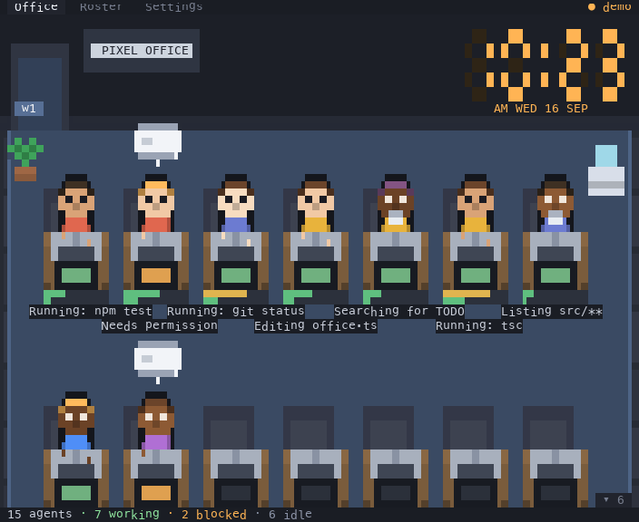

# herdr-pixel-office

A [herdr](https://herdr.dev) plugin that renders your AI coding agents as pixel-art characters working in a tiny top-down office.

<p align="center">
  
</p>

The room has two zones, and where a character *is* tells you what its agent is doing:

- **The desk bank** — agents that are working or blocked sit at a desk, typing, with the monitor glowing in their status color.
- **The break room** — agents with nothing to do head downstairs. They sit on the sofa, wander, stand around chatting, fetch a coffee from the machine, and pair off for table tennis or a game of pool.

When an agent's status changes it walks between the two. Start a turn and the character gets up from the sofa and walks to a desk; finish one and it wanders back. Desks are drawn whether or not anyone is at them, so the room reads as an office rather than a grid of agents.

Characters act out what the agent is actually doing — not just its coarse status. The plugin reads each agent's pane and pulls out the live tool call, so a character **types** while editing or running commands and **reads** while searching, with the tool shown under its desk (`Reading office.ts`, `Running: npm test`). Gauges under each desk track context and rate-limit usage. Idle characters get up and wander the common area, pathing around the furniture, then head back for a sit-down.


## What it reads, and what it doesn't

Worth knowing before you install anything that watches your terminals:

- It calls `agent.read` on your herdr panes, which returns **the visible text of
  those panes** — your prompts, the agent's output, file paths, commands. That is
  how the activity label, the reading-vs-typing animation and the gauges work.
  Only the last ~30 visible lines are requested, and only the derived fields
  (tool name, a truncated label, two percentages, a sub-agent count) are kept.
- It makes **no network connections at all.** The only socket it opens is the
  local herdr Unix socket, and the only process it spawns is `herdr status
  server --json`, to find that socket when the env var is absent. There is no
  telemetry, no analytics, no remote anything, and zero runtime dependencies
  that could add some — `dependencies` in `package.json` is empty and stays that
  way.
- It writes exactly one file: the state below.
- The one thing it does *to* your session is `agent.focus`, when you press Enter
  or click a selected character.

If you would rather it not read pane contents, the office still works without
the scraper — you lose the activity labels, the reading pose and the gauges, but
statuses, zones, wandering and focus all come from `agent.list`.


## Requirements

- [herdr](https://herdr.dev) 0.7.0 or newer — check with `herdr --version`

## Install

### From the herdr marketplace

```bash
herdr plugin install devangchhajed/herdr-pixel-office
```

## Start it

### From the command line

The same action, invoked by hand:

```bash
herdr plugin action invoke open --plugin pixel.office
```

Or open the pane yourself, if you want it somewhere other than a right-hand
split — `--placement` takes `split`, `tab`, `overlay` or `zoomed`:

```bash
herdr plugin pane open --plugin pixel.office --entrypoint office \
  --placement tab --focus
```

### A keybinding (the way you will actually use it)

Add this to `~/.config/herdr/config.toml`:

```toml
[[keys.command]]
key = "prefix+o"
type = "plugin_action"
command = "pixel.office.open"
description = "Open Pixel Office"
```

Then pick it up without restarting your session:

```bash
herdr config check            # catches a typo before it costs you a restart
herdr server reload-config
```

`prefix+o` now opens the office in a split to the right of whatever you are
working in.


## Using it

### Reading the room

The first thing to know is that **position is status** — you can tell what your
agents are doing without reading a word:

- Someone **at a desk** is working or blocked. Look here first.
- Someone **in the break room** is idle, done, or unknown. Nothing needs you.
- An **amber monitor and a raised hand** is an agent blocked on you — a `?`
  bubble for a question, `…` for a permission prompt. The bubble stays up until
  you deal with it, which is why blocked agents keep their desk instead of
  wandering off.
- A **green flickering monitor** is a live turn. The character types for
  write-ish tools and reads a held-up page for read-ish ones.
- A **checkmark that fades** is a turn that just finished.

Under each desk is the live tool call (`Reading office.ts`, `Running: npm test`)
and two gauges for context and rate-limit usage.

### Getting to an agent

Select a character with the arrow keys or a click, then press `Enter` to jump
your terminal to that agent's pane. Clicking an already-selected character does
the same thing in one gesture. That is the main loop: see an amber desk, press
Enter, deal with it.

If you are running more agents than fit on screen, `Tab` to the **Roster** — the
same agents as a table, sorted with anything blocked at the top.

### Keys

| Key | Effect |
|---|---|
| `Tab` | Next screen: Office → Roster → Settings |
| `↑` `↓` `←` `→` | Move the selection; the camera follows |
| `Enter` / `f` | Focus the selected agent's terminal (on Settings, edit the company name) |
| `Home` / `End` | Jump to the desks / the break room |
| `PgUp` / `PgDn` | Scroll half a screen |
| `n` | Name tags on or off |
| `t` | Break-room chatter (off by default) |
| `s` | Bell when an agent blocks |
| `c` | Wall clock |
| `r` | Water reminder |
| `w` | Pin the reminder on screen so you can see it without waiting for the hour |
| `q` | Quit |

### Mouse

| Action | Effect |
|---|---|
| Click a character | Select it |
| Click it again | Focus its terminal |
| Drag a character | Move it to another desk |
| Hover a character | Tooltip: status, activity, project, gauges |
| Scroll wheel | Scroll the room |
| Click a tab | Switch screen |
| Click the cat | It is pleased |

When people are off-screen a `▴ n  ▾ n` hint shows how many are above and below.
